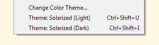

## ChangeTheme

This IDE tool can be assigned to a menu item or keyboard shortcut to "instantly" change your IDE theme, for example from light to dark.  

It's much quicker than `File` > `Preferences` > `Import/Export` > `Load from` > `Open` > `Import Settings` > `OK`

It can be run in three ways:  
`ChangeTheme` (no params) — browse for theme file, then close the IDE, change theme, and reopen  
`ChangeTheme <file>` — close IDE, change theme, and reopen  
`ChangeTheme <file> -a` — **experimental** — same as above, but attempts to change the theme without closing the IDE

The standard PureBasic IDE themes are available as `.prefs` files [here](./ide-themes).  
Solarized (light and dark) themes are available [here](https://github.com/kenmo-pb/Solarized).
