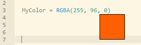

## ColorPreview

This IDE tool will pop up a small color preview box when the mouse cursor hovers over a color in your code.

The color must be a hex literal, an RGB/RGBA function in decimal or hex, or one of the basic named constants.  
For example: `$FF00FF`, `RGB(255, 0, 255)`, or `#Magenta`

Add it to the IDE with two tool triggers:  
`New Sourcecode created`  
`Sourcecode loaded`

Size and other settings are configurable in `ColorPreview.ini`

This tool is currently only implemented on **Windows** due to `SendMessage_()` usage.
