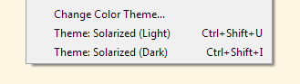

## PureBasic IDE Tools

### [ChangeTheme](./ChangeTheme/)
Switch IDE themes "instantly" by a keyboard shortcut or a Tools menu item.

### [ColorPreview](./ColorPreview/)
Show a visual preview of a color in your code when you hover the mouse over it.

